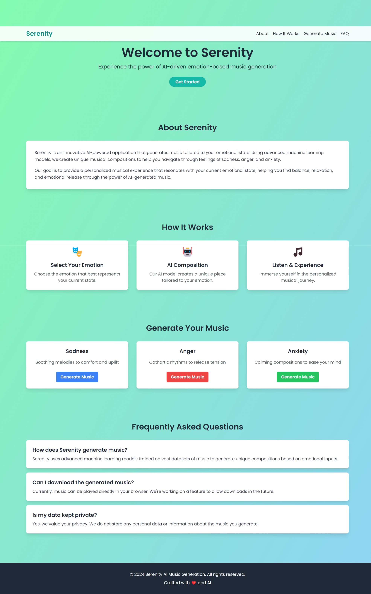

# Serenity AI emotion-based Music Generation Web App

This is a Flask-based web application that generates music using Serenity deep learning LSTM models developed using TF/Keras. The application allows users to generate musical sequences using different pre-trained models and convert them into playable audio.



##How it works


## Prerequisites

Before running the application, make sure you have the following installed:

- Python 3.7 or higher
- pip (Python package installer)

## Installation

1. Clone the repository or unzip the project folder:

```bash
git clone <repository-url>
cd <project-folder>
```

2. Create and activate a virtual environment (recommended):

```bash
python -m venv venv
# On Windows
venv\Scripts\activate
# On macOS/Linux
source venv/bin/activate
```

3. Install the required dependencies:

```bash
pip install flask tensorflow pretty_midi pydub numpy
```

## Project Structure

Ensure your project folder has the following structure:

```
project/
├── app.py
├── model/
│   ├── q1/
│   │   └── music_generation_model_maestro.h5
│   ├── q4/
│   │   ├── music_generation_model_maestro.h5
│   │   └── val_sequences.npy
│   └── maestro/
│       └── val_sequences.npy
├── templates/
│   └── index.html
└── static/
    └── (static files if any)
```

## Configuration

1. Make sure all model files are present in their respective directories:

   - Model files (.h5) in `model/q1/` and `model/q4/`
   - Validation sequences (.npy) in `model/maestro/` and `model/q4/`

2. The application uses three different models:
   - model1: Uses the maestro dataset
   - model2: Uses an alternative configuration
   - model3: Uses q4-specific data

## Running the Application

1. Start the Flask development server:

```bash
python app.py
```

2. Open your web browser and navigate to:

```
http://localhost:5000
```

## Features

- Generate music using different pre-trained models
- Convert MIDI sequences to WAV audio files
- Web interface for easy interaction
- Share feedback through an integrated feedback form

## Routes

- `/` - Home page
- `/generate/<model_name>` - Generate music using specified model
- `/share-feedback` - Redirect to feedback form

## Important Notes

1. The application requires sufficient memory to load the deep learning models
2. Ensure you have write permissions in the directory for temporary file creation
3. The generation process might take a few seconds depending on your hardware
4. Generated music follows C major scale for musical coherence

## Troubleshooting

If you encounter any issues:

1. Ensure all dependencies are correctly installed
2. Verify model files are present in the correct directories
3. Check system permissions for file operations
4. Make sure ports are not blocked by other applications

## Feedback

Users can provide feedback through the integrated feedback form accessible via the `/share-feedback` route.

## System Requirements

- RAM: Minimum 8GB recommended
- Storage: At least 1GB free space
- Processor: Modern CPU with good single-thread performance
- Operating System: Windows 10+, macOS 10.14+, or Linux

## License

[Add your license information here]
